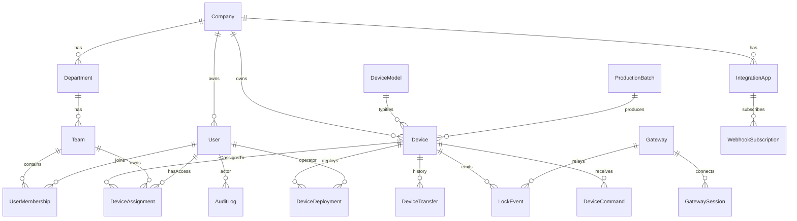
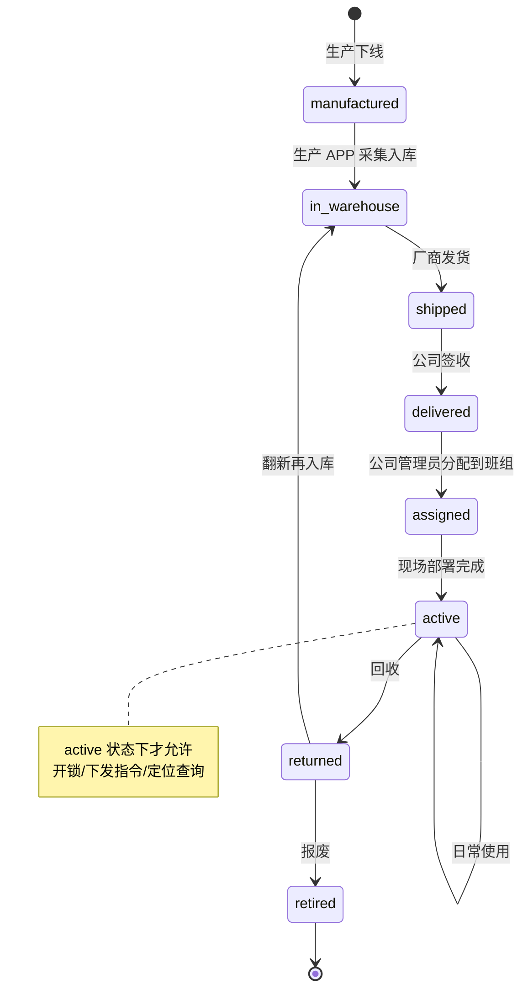

# 数据模型（Data Model）

**版本**: v0.1 草案
**状态**: 待审核 → 审核通过后进 Prisma schema

本文用 Mermaid ER 图 + 字段表描述平台的核心数据结构。行文尺度是"够一个后端工程师照着写 Prisma schema"。

---

## 0. 建模原则

- **多租户隔离**：凡是业务数据表都带 `company_id`（NULL 表示属于厂商层）。查询时按当前登录用户所属公司自动过滤。
- **软删除**：所有核心业务表带 `deleted_at`（NULL=有效）。报表/审计不应丢失历史数据。
- **审计**：敏感操作（分配、部署、开锁、密码改动）进独立 `audit_log` 表，**永不软删**。
- **时间**：统一用 UTC 时间戳存储，前端按时区渲染。
- **ID**：业务主键用 `bigint` 自增；对外暴露的 ID 用 `ulid`（字符串，前端看得懂，不泄露数量）。
- **枚举**：用 Prisma enum 或 PostgreSQL check constraint，避免脏字符串。

---

## 1. 整体 ER 图

> 下面按主题分组列字段。为了保持文档精简，公共字段（`id`, `ulid`, `created_at`, `updated_at`, `deleted_at`）默认每张表都有，后面不重复写。

---

## 2. 账户与组织

### 2.1 `company` — 公司（租户）

| 字段 | 类型 | 约束 | 说明 |
|---|---|---|---|
| `name` | varchar(128) | NOT NULL | 公司名 |
| `short_code` | varchar(32) | UNIQUE | 短代码（给对接 API 用） |
| `industry` | enum | | `logistics` / `security` / `other` |
| `contact_name` | varchar(64) | | 主联系人 |
| `contact_phone` | varchar(32) | | |
| `status` | enum | | `active` / `suspended` |
| `plan` | enum | | `trial` / `standard` / `enterprise` |
| `max_devices` | int | | 配额上限，NULL=无限 |
| `created_by_user_id` | bigint FK | | 厂商侧哪个人开的这个公司 |

### 2.2 `department` — 部门

| 字段 | 类型 | 约束 | 说明 |
|---|---|---|---|
| `company_id` | bigint FK | NOT NULL | |
| `parent_id` | bigint FK | | 部门可以嵌套（可选） |
| `name` | varchar(128) | NOT NULL | |
| `code` | varchar(32) | | 部门编号 |

### 2.3 `team` — 班组

| 字段 | 类型 | 约束 | 说明 |
|---|---|---|---|
| `company_id` | bigint FK | NOT NULL | |
| `department_id` | bigint FK | NOT NULL | |
| `name` | varchar(128) | NOT NULL | |
| `leader_user_id` | bigint FK | | 班组长 |

### 2.4 `user` — 人员 / 开锁账号

| 字段 | 类型 | 约束 | 说明 |
|---|---|---|---|
| `company_id` | bigint FK | | NULL=厂商员工 |
| `phone` | varchar(32) | UNIQUE | 登录用 |
| `email` | varchar(128) | | |
| `name` | varchar(64) | NOT NULL | |
| `employee_no` | varchar(32) | | 工号 |
| `password_hash` | varchar(255) | | bcrypt |
| `role` | enum | | `vendor_admin` / `company_admin` / `dept_admin` / `team_leader` / `member` / `production_operator` |
| `status` | enum | | `active` / `locked` / `invited` |
| `last_login_at` | timestamp | | |
| `avatar_url` | varchar(512) | | OSS 地址 |

> 注意：`user` 不直接和 `team` 多对多绑定，中间走 `user_membership`，方便一个人同时属于多个班组（常见于跨组项目）。

### 2.5 `user_membership` — 人员-班组关联

| 字段 | 类型 | 说明 |
|---|---|---|
| `user_id` | bigint FK | |
| `team_id` | bigint FK | |
| `role_in_team` | enum | `leader` / `member` |
| `joined_at` | timestamp | |

唯一约束：`(user_id, team_id)`。

---

## 3. 设备

### 3.1 `device_model` — 设备型号

| 字段 | 类型 | 说明 |
|---|---|---|
| `code` | varchar(32) UNIQUE | 型号代码，如 `GPS-LOGI-01` |
| `name` | varchar(128) | 展示名 |
| `category` | enum | `gps_lock` / `eseal` / `fourg_eseal` / `fourg_padlock` |
| `scene` | enum | `logistics` / `security` |
| `has_ble` | bool | 有 BLE 模块（一般都是 true） |
| `has_4g` | bool | |
| `has_gps` | bool | |
| `has_lora` | bool | |
| `firmware_default` | varchar(32) | 出厂固件版本 |
| `capabilities_json` | jsonb | 支持的指令集 / 额外字段扩展 |

**预置数据**：

| code | category | scene | 4G | GPS | LoRa |
|---|---|---|---|---|---|
| GPS-LOGI-01 | gps_lock | logistics | ✅ | ✅ | ❌ |
| ESEAL-LOGI-01 | eseal | logistics | ❌ | ❌ | ❌ |
| 4GSEAL-LOGI-01 | fourg_eseal | logistics | ✅ | ❌ | ❌ |
| 4GPAD-SEC-01 | fourg_padlock | security | ✅ | ❌ | ✅ |

### 3.2 `device` — 设备实例（锁）

| 字段 | 类型 | 约束 | 说明 |
|---|---|---|---|
| `lock_id` | varchar(32) | UNIQUE NOT NULL | QR 码编号，业务主键（如 `60806001`） |
| `ble_mac` | varchar(17) | UNIQUE NOT NULL | `E1:6A:9C:F1:F8:7E`（无冒号存也行，见实现） |
| `imei` | varchar(20) | UNIQUE | 4G 模组 IMEI，电子铅封为 NULL |
| `model_id` | bigint FK | NOT NULL | `device_model.id` |
| `batch_id` | bigint FK | | 生产批次 |
| `firmware_version` | varchar(32) | | |
| `qc_status` | enum | | `pending` / `passed` / `failed` |
| `produced_at` | timestamp | | 出厂时间 |
| `status` | enum | | 见 §3.3 |
| `owner_type` | enum | | `vendor` / `company` |
| `owner_company_id` | bigint FK | | status≥delivered 时必填 |
| `current_team_id` | bigint FK | | status≥assigned 时必填 |
| `location_lat` | decimal(10,7) | | GPS 纬度 |
| `location_lng` | decimal(10,7) | | GPS 经度 |
| `location_accuracy_m` | int | | 定位精度（米） |
| `door_label` | varchar(128) | | 用户填的门号/位置名 |
| `deployed_at` | timestamp | | |
| `deployed_by_user_id` | bigint FK | | |
| `last_state` | enum | | `opened` / `closed` / `tampered` / `unknown` |
| `last_battery` | smallint | | 0-100 |
| `last_seen_at` | timestamp | | 最近一次收到该锁上报 |
| `gateway_id` | bigint FK | | 归属的网关（LoRa 设备才有） |
| `lora_e220_addr` | int | | LoRa 地址（0..65535） |
| `lora_channel` | smallint | | |
| `server_ip` | varchar(64) | | 4G 锁烧录进去的服务器 IP |
| `server_port` | int | | |
| `notes` | text | | |

**索引**：`(ble_mac)`、`(imei)`、`(owner_company_id, status)`、`(current_team_id)`、`(gateway_id)`、`(lock_id)`。

### 3.3 设备生命周期 `device.status`

### 3.4 `production_batch` — 生产批次

| 字段 | 类型 | 说明 |
|---|---|---|
| `batch_no` | varchar(32) UNIQUE | 如 `2026-04-B001` |
| `model_id` | bigint FK | 型号 |
| `quantity` | int | 批次规划数量 |
| `produced_count` | int | 实际采集入库数 |
| `produced_at` | date | |
| `operator_user_id` | bigint FK | 生产线操作员 |
| `remark` | text | |

### 3.5 `device_transfer` — 设备流转记录

每次状态变更（尤其权属变更）插一条。审计追溯用。

| 字段 | 类型 | 说明 |
|---|---|---|
| `device_id` | bigint FK | |
| `from_status` | enum | |
| `to_status` | enum | |
| `from_owner_type` | enum | |
| `from_owner_id` | bigint | |
| `to_owner_type` | enum | |
| `to_owner_id` | bigint | |
| `operator_user_id` | bigint FK | |
| `reason` | varchar(255) | |
| `metadata` | jsonb | 发货单号等 |

### 3.6 `device_deployment` — 现场部署记录

保留历史，每次部署（含重新部署）新增一条。

| 字段 | 类型 | 说明 |
|---|---|---|
| `device_id` | bigint FK | |
| `operator_user_id` | bigint FK | |
| `team_id` | bigint FK | 部署完成后归属班组 |
| `lat` | decimal(10,7) | |
| `lng` | decimal(10,7) | |
| `accuracy_m` | int | |
| `door_label` | varchar(128) | |
| `photo_urls` | jsonb | OSS URL 数组 |
| `deployed_at` | timestamp | |

### 3.7 `device_assignment` — 设备-班组-人员权限

控制"谁能开哪把锁"。支持三种粒度：

| scope | 说明 |
|---|---|
| `company` | 公司内所有人都可开（少见，一般是测试用） |
| `team` | 班组所有成员可开（最常见） |
| `user` | 单点人员 |

| 字段 | 类型 | 说明 |
|---|---|---|
| `device_id` | bigint FK | |
| `company_id` | bigint FK | |
| `scope` | enum | `company` / `team` / `user` |
| `team_id` | bigint FK | scope=team/company 时填 |
| `user_id` | bigint FK | scope=user 时填 |
| `valid_from` | timestamp | |
| `valid_until` | timestamp | 时间窗限制，NULL=永久 |
| `granted_by_user_id` | bigint FK | |
| `revoked_at` | timestamp | 软撤销 |

---

## 4. 网关

### 4.1 `gateway` — 网关设备

| 字段 | 类型 | 说明 |
|---|---|---|
| `gw_id` | varchar(16) UNIQUE | 8 位 ASCII ID，如 `00000017` |
| `token` | varchar(32) | 鉴权 token |
| `company_id` | bigint FK | 归属公司，NULL=厂商自留 |
| `model` | varchar(64) | 型号字符串，如 `E90-DTU(900SL22-GPRS)` |
| `location_lat` | decimal(10,7) | |
| `location_lng` | decimal(10,7) | |
| `location_note` | varchar(255) | |
| `lora_freq_band` | smallint | 频段 |
| `lora_channel` | smallint | |
| `status` | enum | `provisioning` / `active` / `suspended` / `retired` |
| `last_seen_at` | timestamp | 最近一次 TCP 连接 |
| `online` | bool | 当前 TCP 是否连接中（运行时字段，可选落库） |

### 4.2 `gateway_session` — 网关连接会话

| 字段 | 类型 | 说明 |
|---|---|---|
| `gateway_id` | bigint FK | |
| `client_ip` | varchar(64) | 网关连来的 IP |
| `connected_at` | timestamp | |
| `disconnected_at` | timestamp | NULL=在线 |
| `disconnect_reason` | varchar(128) | |

---

## 5. 事件与指令

### 5.1 `lock_event` — 锁事件（按日期分表/分区）

**高频写入表**，按 `created_at` 月分区。保留 12 个月热数据。

| 字段 | 类型 | 说明 |
|---|---|---|
| `device_id` | bigint FK | |
| `company_id` | bigint FK | 冗余，便于租户过滤 |
| `event_type` | enum | `opened` / `closed` / `tampered` / `heartbeat` / `low_battery` / `offline` / `online` |
| `source` | enum | `ble` / `lora` / `4g` / `system` |
| `battery` | smallint | |
| `lat` | decimal(10,7) | GPS 锁才有 |
| `lng` | decimal(10,7) | |
| `gateway_id` | bigint FK | LoRa 路径才有 |
| `operator_user_id` | bigint FK | BLE 本地开锁才有 |
| `raw_payload` | bytea | 原始字节，便于回放 |
| `dedup_key` | varchar(128) | 防重（5s 窗口内同事件只保留一条的 key） |
| `created_at` | timestamp | 锁侧/网关侧时间戳 |
| `received_at` | timestamp | 平台接收时间 |

**索引**：`(device_id, created_at DESC)`、`(company_id, created_at DESC)`、`(event_type, created_at DESC)`。

### 5.2 `device_command` — 远程指令

| 字段 | 类型 | 说明 |
|---|---|---|
| `device_id` | bigint FK | |
| `command_type` | enum | `unlock` / `lock` / `query_status` / `config_network` |
| `issued_by_user_id` | bigint FK | |
| `source` | enum | `web` / `app` / `api` |
| `gateway_id` | bigint FK | 实际下发的网关 |
| `request_payload` | bytea | 发给网关的帧 |
| `status` | enum | `pending` / `sent` / `acked` / `timeout` / `failed` |
| `retries` | smallint | |
| `sent_at` | timestamp | |
| `acked_at` | timestamp | |
| `timeout_at` | timestamp | 10s 后检查是否有状态变更事件 |
| `result_event_id` | bigint FK | 关联到确认此命令的 lock_event |
| `error_message` | varchar(255) | |

---

## 6. 生产采集

### 6.1 `production_scan` — 生产线单次采集记录

| 字段 | 类型 | 说明 |
|---|---|---|
| `batch_id` | bigint FK | |
| `device_id` | bigint FK | 写入 device 后的 id |
| `operator_user_id` | bigint FK | 生产 APP 登录人 |
| `qr_scanned` | varchar(64) | 扫到的 QR 原文 |
| `ble_mac_read` | varchar(17) | |
| `imei_read` | varchar(20) | |
| `firmware_version_read` | varchar(32) | |
| `qc_result` | enum | `passed` / `failed` |
| `qc_remark` | varchar(255) | |
| `scanned_at` | timestamp | |
| `duration_ms` | int | 从扫 QR 到入库耗时，便于优化产线 |

---

## 7. 对接层 API

### 7.1 `integration_app` — 第三方对接应用

| 字段 | 类型 | 说明 |
|---|---|---|
| `company_id` | bigint FK | NOT NULL |
| `name` | varchar(128) | |
| `app_key` | varchar(32) UNIQUE | |
| `app_secret_hash` | varchar(255) | bcrypt，只存 hash |
| `scopes` | jsonb | 权限范围：`["device:read","event:push","command:write"]` |
| `ip_whitelist` | jsonb | |
| `status` | enum | `active` / `revoked` |

### 7.2 `webhook_subscription` — 事件推送订阅

| 字段 | 类型 | 说明 |
|---|---|---|
| `integration_app_id` | bigint FK | |
| `url` | varchar(512) | |
| `event_types` | jsonb | 订阅的事件 type 数组 |
| `secret` | varchar(64) | 用于签名 HMAC-SHA256 |
| `active` | bool | |
| `last_success_at` | timestamp | |
| `last_failure_at` | timestamp | |
| `failure_count` | int | |

### 7.3 `webhook_delivery` — 推送投递记录（按日期分区）

| 字段 | 类型 | 说明 |
|---|---|---|
| `subscription_id` | bigint FK | |
| `event_id` | bigint FK | |
| `http_status` | smallint | |
| `response_body` | text | 截断到 2KB |
| `duration_ms` | int | |
| `attempt` | smallint | |
| `sent_at` | timestamp | |

---

## 8. 审计与系统

### 8.1 `audit_log`

| 字段 | 类型 | 说明 |
|---|---|---|
| `company_id` | bigint | |
| `actor_user_id` | bigint FK | |
| `actor_ip` | varchar(64) | |
| `action` | varchar(64) | 如 `device.assign`、`user.login`、`device.unlock_remote` |
| `target_type` | varchar(32) | 如 `device` / `user` |
| `target_id` | bigint | |
| `diff` | jsonb | 前后快照 |
| `created_at` | timestamp | |

**这张表永不软删，不加 `deleted_at`。**

### 8.2 `system_config` — 系统配置

KV 表，`key` 唯一，`value` jsonb。用于后台可配置项（默认参数、功能开关）。

---

## 9. 待定 / 后续补充

- **OTA 固件升级表**：`firmware_package`、`device_firmware_task` — 等 OTA 需求成熟再建
- **短信/推送模板表**：后期做告警通道时加
- **用户通知表**：`user_notification` — 收到告警后 APP 显示用
- **地理围栏表**：`geofence`、`geofence_device` — 物流 GPS 锁场景需要，二期做

---

## 修订历史

| 版本 | 日期 | 修改 |
|---|---|---|
| v0.1 | 2026-04-22 | 初稿 |
